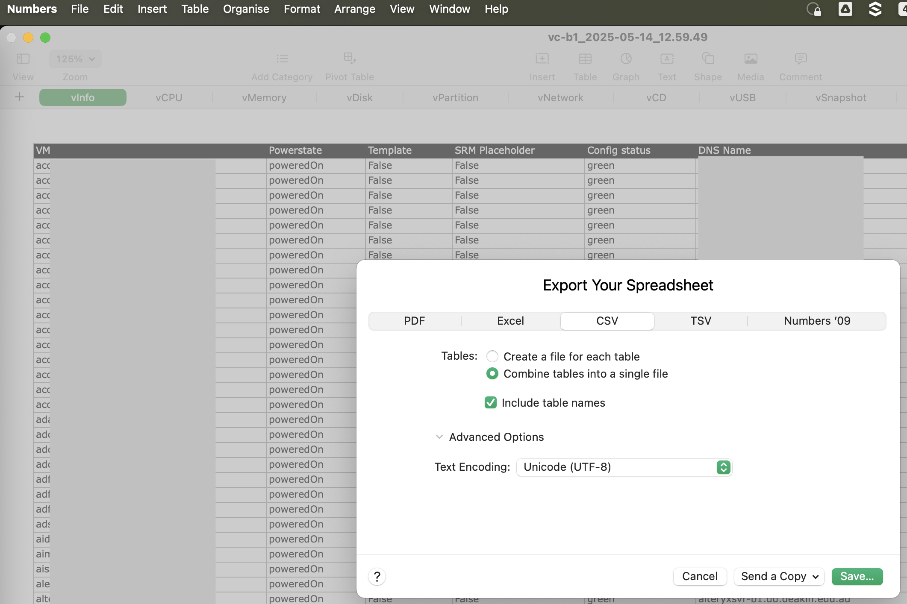

# VM Migration Analyzer from RVTools Export

## DISCLAIMER

This script is provided as-is and may be outdated or incomplete. You are encouraged to modify or extend it to suit your specific environment and requirements.

The generated risk score is a heuristic and may not capture all complexities of individual VMs, migration scenarios, or the latest changes in target technologies. Always validate the results against detailed VM data, project-specific needs, and the most recent official documentation from Red Hat and other relevant vendors.

## Overview

This Python script ( [analyze_vms_mk.py](analyze_vms_mk.py) ) processes an export from RVTools (a VMware vSphere infrastructure reporting tool) to analyze Virtual Machines (VMs) for migration readiness. It's particularly focused on gathering information potentially relevant for planning migrations to platforms like Red Hat OpenShift Virtualization, often facilitated by tools such as the Migration Toolkit for Virtualization (MTV). Always consider all current technical and non-technical aspects of your real project.

The script generates a text-based report that summarizes VM characteristics, identifies potential migration complexities based on hardware, OS, VMware Tools status, and other factors, and provides a heuristic risk score to help prioritize migration efforts.

## Prerequisites

* **Python 3.x**: The script is written in Python (tested with Python 3.13.3).
* **RVTools**: You need RVTools to generate the input data from your VMware vSphere environment.
* **Pandas Library**: The script uses the pandas library for data manipulation (see [requirements.txt](requirements.txt)).

## Input Data Preparation

### What is RVTools?

**RVTools** is a popular Windows .NET application that uses the vSphere Management SDK to display and export information about your virtual environments. It can list details about VMs, hosts, datastores, networks, and much more. For this script, we are interested in its capability to export comprehensive VM data to CSV.

### Generating the Input CSV File from RVTools

The script expects a consolidated **single CSV file** about your environment that contains multiple sheets/tables exported by RVTools.

1. In RVTools, after connecting to your vCenter or ESXi host(s), ensure you have the relevant data tabs populated (especially vInfo, vDisk, vNetwork, vSnapshot, vTools).
2. Combine the data you get from RVTools as shown in screenshot  into a single CSV file.
   A sample input file, [vc-g1_2025-06-04_12.59_full.csv](vc-g1_2025-06-04_12.59_full.csv), is provided in this repository to demonstrate the expected format and content.

## DRAFT: General OS Complexity Mapping

The script uses another CSV file to map operating system names (as reported by VMware Tools or the VM configuration) to a migration complexity category and a standardized OS name. This helps in assessing migration risks and grouping VMs.
You are welcome to modify the provided "general complexity" categories to better fit your specific use case.

* A sample mapping file is provided: [OS Breakdown-Table 1.csv](OS%20Breakdown-Table%201.csv) .
* This file contains columns like `OS Name from vInfo/Tools`, `Standardized OS Name`, and `Migration Complexity`.
* The `Migration Complexity` should provide overall complexity assessment for migrating that particular OS. You can customize this file to reflect your organization's specific criteria and experience using the provided sample.

## Running the Script

To run the script, use the following command structure:

```bash
python analyze_vms_mk.py <path_to_your_rvtools_export.csv> 
```

For example:
```
python analyze_vms_mk.py vc-g1_2025-06-04_12.59_full.csv

Processing RVTools export: vc-g1_2025-06-04_12.59_full.csv
Using OS mapping CSV: OS Breakdown-Table 1.csv
Output report will be: vc-g1_2025-06-04_12.59_full__migration_focused_report.txt
Attempting to read sheet: 'vInfo' from vc-g1_2025-06-04_12.59_full.csv
Found sheet marker 'vInfo: Table 1' at line 1. Header expected at line 2.
INFO: Stopping data for 'vInfo' at blank line 32. Next line 33 is 'vDisk: Table 1'.
Successfully processed sheet 'vInfo' line-by-line, loaded 29 VM records.
Attempting to read sheet: 'vDisk' from vc-g1_2025-06-04_12.59_full.csv
Found sheet marker 'vDisk: Table 1' at line 33. Header expected at line 34.
INFO: Stopping data for 'vDisk' at blank line 77. Next line 78 is 'vNetwork: Table 1'.
Warning: For sheet 'vDisk', expected columns NOT FOUND (will be empty): Disk Path, Thin
Successfully processed sheet 'vDisk' with pandas, loaded 42 rows.
Attempting to read sheet: 'vNetwork' from vc-g1_2025-06-04_12.59_full.csv
Found sheet marker 'vNetwork: Table 1' at line 78. Header expected at line 79.
INFO: Stopping data for 'vNetwork' at blank line 111. Next line 112 is 'vSnapshot: Table 1'.
Warning: For sheet 'vNetwork', expected columns NOT FOUND (will be empty): NIC label, Adapter, Type, IPv4 Address
Successfully processed sheet 'vNetwork' with pandas, loaded 31 rows.
Attempting to read sheet: 'vSnapshot' from vc-g1_2025-06-04_12.59_full.csv
Found sheet marker 'vSnapshot: Table 1' at line 112. Header expected at line 113.
INFO: Stopping data for 'vSnapshot' at blank line 120. Next line 121 is 'vTools: Table 1'.
Warning: For sheet 'vSnapshot', expected columns NOT FOUND (will be empty): Name, Date / time, Size MiB (vmsn), State
Successfully processed sheet 'vSnapshot' with pandas, loaded 6 rows.
Attempting to read sheet: 'vTools' from vc-g1_2025-06-04_12.59_full.csv
Found sheet marker 'vTools: Table 1' at line 121. Header expected at line 122.
Warning: For sheet 'vTools', expected columns NOT FOUND (will be empty): Tools
Successfully processed sheet 'vTools' with pandas, loaded 29 rows.

Enriching VM data with migration considerations...

Generating migration analysis report for 29 VMs (includes templates and excluded)...

Report successfully generated: vc-g1_2025-06-04_12.59_full__migration_focused_report.txt
```

The output file is described in the last line above:
```
...
Report successfully generated: vc-g1_2025-06-04_12.59_full__migration_focused_report.txt
```

## Output

The script generates a report as a plain text file in the working directory. 

A sample report, [vc-g1_2025-06-04_12.59_full__migration_focused_report.txt](vc-g1_2025-06-04_12.59_full__migration_focused_report.txt), generated from the sample input, is provided to show the typical output.

This report includes:
* A summary of the input files used.
* An overview of VMs processed, including counts by power state and OS family.
* A summary table of VMs by their calculated draft Migration Risk Score.
* Detailed information for each VM, including:
    * Basic VM info (CPU, Memory, OS, Power State, VMware Tools status).
    * Hardware version and firmware type.
    * Disk information (count, total capacity, thin/thick provisioning).
    * Snapshot details.
    * Network adapter details.
    * DRAFT: A calculated Migration Risk Score (Low, Medium, High, Very High) based on various factors.
    * DRAFT: Specific migration considerations and potential warnings (e.g., old hardware version, snapshots present, old VMware tools, specific OS concerns).

## Key Features Analyzed

WARNING: The logic of the script may be incomplete or outdated.

The script considers several factors to assess migration readiness and complexity, including:
* Operating System: Type, version, and known compatibility/migration challenges.
* VMware Tools: Status (current, old, not running, not installed).
* Hardware Version: Older hardware versions might require upgrades or present limitations.
* Firmware: BIOS vs. EFI. EFI is generally preferred for modern platforms.
* CPU and Memory: Basic resource allocation.
* Disk Configuration: Number of disks, thin vs. thick provisioning, controller types (IDE/SATA can be problematic).
* Snapshots: Presence of snapshots usually indicates a VM that needs attention before migration.
* VM Templates: Identifies if a VM is a template.
* Power State: Powered off VMs are typically easier to migrate.
* Annotations: Checks for specific keywords in annotations that might indicate deprecation or other states.
* Consolidation Needed: Flags VMs that require disk consolidation.

## Exclusion Patterns

The script includes a mechanism to exclude certain VMs from detailed analysis based on regular expression patterns defined within the script (see `EXCLUSION_REGEX_PATTERNS` in the script). This is useful for filtering out infrastructure VMs, test VMs, or other categories not intended for migration. Excluded VMs are still listed in a separate section of the report for completeness but do not contribute to the main risk analysis.

## Target Migration Platform Context

While the script provides general VM insights, it's developed with migrations to/with modern virtualization platforms in mind, such as:

* Red Hat OpenShift Virtualization: Allows you to run and manage virtual machines alongside containers on the OpenShift Container Platform. More information can be found here https://www.redhat.com/en/technologies/cloud-computing/openshift/virtualization .
* Migration Toolkit for Virtualization (MTV): Based on the open-source project Forklift ( https://github.com/kubev2v/forklift ), MTV helps automate and streamline the migration of VMs from various sources (including VMware vSphere) to OpenShift Virtualization. Explore MTV further at https://developers.redhat.com/products/mtv/overview .

The analysis provided by this script can potentially help in planning for migration using tools like MTV. Always consider all current technical and non-technical aspects of your real project.

## Automation Potential for Migration

The migration process, especially at scale, benefits greatly from automation.

* Ansible can play a crucial role by wrapping and extending MTV workflows. This includes automating pre-migration checks (some of which this script helps identify), post-migration validation, and orchestrating comprehensive end-to-end migration flows.
* For a visual guide on how Ansible can streamline VMware to OpenShift Virtualization migrations, see: "Streamline VMware to OpenShift Virtualization Migration with Ansible Automation Platform"  https://www.youtube.com/watch?v=oaKMF4s3d3s .

## Author

Michael Knyazev
* LinkedIn: https://www.linkedin.com/in/mikhailkniazev/
* GitHub: https://github.com/mikhailknyazev

## License

MIT License

Copyright (c) 2025 Michael Knyazev (Mikhail Vladimirovich Kniazev)
